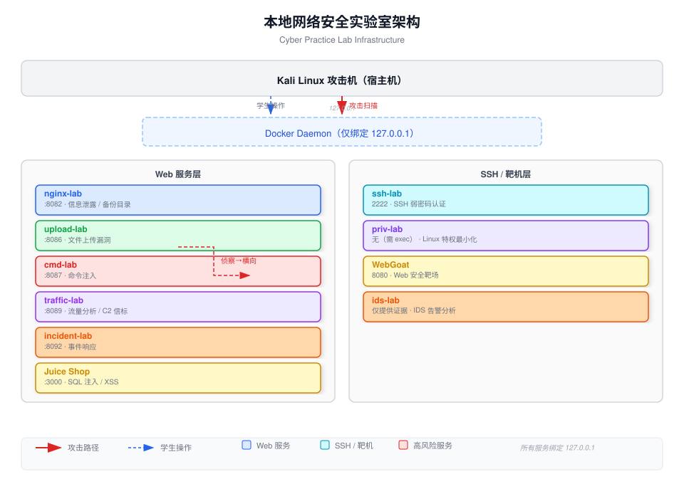

# 网络安全实战课程

### Cyber Practice Lab

<Transform :scale="0.85">

**南京航空航天大学** · 信息安全方向

赵彦超 · 陈兵

</Transform>

<div class="pt-6">
  <span class="px-2 py-1 rounded cursor-pointer" hover="bg-white bg-opacity-10" @click="next">
    开始 →
  </span>
</div>

<style>
  h1 { color: #ffffff; text-shadow: 0 0 30px rgba(0,0,0,0.5); }
</style>

---

# 课程信息

## 上课时间

| 周次 | 星期 | 节次 |
|------|------|------|
| 第 11-16 周 | 星期一 | 第 7-10 节 |
| 第 11-14 周 | 星期三 | 第 9-11 节 |
| 第 15-17 周 | 星期三 | 第 5-8 节 |

## 实验安排

- 共 **12 个实验**，每周发布 4 个题目，**完成 2 个**即可
- 实验在本地 Kali 环境（`127.0.0.1`）进行
- **无需在实验平台上提交**，完成后在超星上传报告

## 助教团队

李晔 · 李博文 · 于磊 · 杨超越 · 周健文

> 有问题可在 QQ 群随时提问，助教会及时答复

---

# 重要原则：课程边界

<Transform :scale="0.9">

```
⚠️ 所有实验严格限制在 127.0.0.1 范围内

禁止扫描 campus 网络、同学主机或任何外部 IP

违规者将被终止实验资格并报告教务
```

</Transform>

**为什么？**
- 这是一个**隔离的本地实验环境**
- 攻击真实系统是**违法行为**（《网络安全法》第27条）
- 你的任务是**掌握防御技术**，不是伤害他人

<style>
  strong { color: #ef4444; }
</style>

---

# 课程概述

## 我们要做什么？

- 🔴 **12 个黑客攻防实验**，从零构建攻击者视角
- 🛡️ **真实漏洞靶场**，而非模拟环境
- 📊 **完整攻击链**：侦察 → 利用 → 横向 → 目标达成
- 📝 **技术报告写作**，锻炼表达与复盘能力

## 你将掌握

| 工具 | 用途 |
|------|------|
| nmap / curl | 侦察与指纹识别 |
| Burp Suite | Web 漏洞测试 |
| Wireshark / tcpdump | 流量分析与 C2 检测 |
| jq / 日志分析 | IDS 告警与日志关联 |

---

# 实验环境架构



---

# 实验列表

| # | 主题 | 核心技能 | 靶场 |
|---|------|---------|------|
| Lab01 | 侦察与资产发现 | nmap 扫描、指纹识别 | 所有服务 |
| Lab02 | Web 信息泄露 | 目录发现、日志分析 | nginx-lab |
| Lab03 | 认证审计 | SSH 暴力破解、日志取证 | ssh-lab |
| Lab04 | SQL 注入 | UNION 注入、盲注 | Juice Shop / WebGoat |
| Lab05 | XSS 与会话安全 | CSP、Cookie 属性 | Juice Shop / WebGoat |
| Lab06 | 文件上传漏洞 | 绕过、webshell | upload-lab |
| Lab07 | 命令注入 | shell=True 危险、RCE | cmd-lab |
| Lab08 | Linux 特权最小化 | sudo 审计、权限分析 | priv-lab |
| Lab09 | 流量分析 | tcpdump、Wireshark、C2 检测 | traffic-lab |
| Lab10 | IDS 告警分析 | jq、告警分诊 | eve.json |
| Lab11 | 日志关联 | 多源日志、攻击时间线 | 所有日志 |
| Lab12 | 事件响应 | 证据收集、报告撰写 | incident-lab |

---

# 快速上手：启动第一个实验

```bash
# 第一步：进入工作目录
cd ~/cyber-practice

# 第二步：安装环境（仅首次）
./install-kali.sh

# 第三步：检查工具是否就绪
./check-env.sh

# 第四步：进入学生入口（渐进式引导界面）
./student.sh
```

<Transform :scale="0.75">

> 💡 `./student.sh` 会显示 TUI 菜单，输入密码解锁实验，即可逐步开始。

</Transform>

---

# 实验操作流程

```
┌─────────────────────────────────────────────────────────────┐
│ 1. 进入学生入口                                            │
│    ./student.sh                                              │
│                          ↓                                   │
│ 2. 输入密码解锁 → 逐步阅读 WHY / DO / CHECK                  │
│    WHY：为什么要这么做（原理）                                │
│    DO：执行什么命令（操作）                                   │
│    CHECK：验证操作是否正确                                    │
│                          ↓                                   │
│ 3. 自动验证或手动确认完成                                    │
│    每步完成后自动进入下一步                                   │
│                          ↓                                   │
│ 4. 完成实验 → 查看交付物要求                                  │
│    查阅 tutorial/TUTORIAL.md 中的「交付物」章节              │
│    将报告提交至超星平台                                       │
└─────────────────────────────────────────────────────────────┘
```

**提示**：卡住时按 `h` 获取渐进式提示，最后才会看到完整答案。

---

# 靶场服务一览

| 服务 | 地址 | 说明 |
|------|------|------|
| nginx-lab | `http://127.0.0.1:8082` | Web 信息泄露、备份目录 |
| ssh-lab | `ssh student@127.0.0.1 -p 2222` | 弱密码认证（密码：Student123）|
| upload-lab | `http://127.0.0.1:8086` | 文件上传漏洞 |
| cmd-lab | `http://127.0.0.1:8087` | 命令注入 RCE |
| traffic-lab | `http://127.0.0.1:8089` | 流量分析、C2 信标 |
| incident-lab | `http://127.0.0.1:8092` | 事件响应综合靶机 |
| Juice Shop | `http://127.0.0.1:3000` | SQL 注入、XSS 靶场 |
| WebGoat | `http://127.0.0.1:8080/WebGoat` | OWASP 官方靶场 |

---

# 实验报告要求

## 评分维度（100分）

| 维度 | 分值 | 要求 |
|------|------|------|
| 操作完成度 | 20 | 正确启动实验，完成核心任务 |
| 证据收集 | 25 | 截图、日志、命令输出完整 |
| 技术原理阐述 | 20 | 准确解释漏洞原理和攻击过程 |
| 防御方案 | 20 | 可行、完整、可落地 |
| 报告质量 | 15 | 结构清晰、分析深度 |

## 常见错误

```
❌ 报告只有截图没有说明文字
❌ 复制工具输出而不分析其含义
❌ 防御方案过于笼统（如"加强密码策略"）
❌ 未回答思考题
❌ 使用 LLM 生成千篇一律的通用回答
```

## 提交方式

- 实验完成后查阅 `tutorial/TUTORIAL.md` 中的**交付物**章节
- 按要求准备报告，在**超星平台**提交
- 无需在实验平台上提交

---

# 工具速查

```bash
# 学生入口（TUI 菜单，逐步引导）
./student.sh

# 启动实验（如果不用 student.sh）
./reset-lab.sh lab04

# 端口扫描
nmap -sS -p 3000,8080,8082,8086,2222 127.0.0.1

# HTTP 检测
curl -I http://127.0.0.1:8082/

# Docker 操作
docker compose ps
docker logs nginx-lab 2>&1 | tail -20

# 启动/停止实验
./start-lab.sh lab04
./stop-lab.sh
./reset-lab.sh lab04

# 验证环境
./verify-lab-env.sh
```

---

# 学习建议

## 进攻者思维

> "你要知道攻击是怎么发生的，才能知道如何防御它。"

- 每个实验先理解**攻击原理**，再动手
- 关注攻击者的**第一步**是什么（侦察？弱口令？）
- 尝试理解攻击者的**完整链条**（侦察 → 初始访问 → 横向 → 目标）

## 防御者思维

- 做完攻击实验后，问自己：**如果我是防守方，怎么发现这种攻击？**
- 每个实验都要求你提出防御方案，这是核心输出

## 记录习惯

- 边做边截图，不要事后补
- 命令输出直接复制保存
- 日志分析要标注关键行
- 做完实验后**主动关闭虚拟机**，节省服务器资源

---

# 常见问题

**Q：工具报错 "permission denied"**
```bash
# Docker 需要 root 权限
sudo docker compose up -d

# 或者将当前用户加入 docker 组（需要重新登录）
sudo usermod -aG docker $USER
newgrp docker
```

**Q：服务启动后无法访问**
```bash
# 重置实验
./reset-lab.sh lab04

# 检查容器状态
docker compose ps
```

**Q：实验手册的 jq 命令报错**
```bash
# eve.json 是 NDJSON 格式，需要加 -s
jq -s '.[] | .alert.signature' evidence/ids/eve.json
```

---

# 资源链接

## 漏洞数据库

- **CVE**：cve.mitre.org
- **NVD**：nvd.nist.gov
- **Exploit-DB**：exploit-db.com
- **OWASP Top 10**：owasp.org/www-project-top-ten
- **ATT&CK Matrix**：attack.mitre.org

## 实验手册

每个实验的 `TUTORIAL.md` 在对应目录下（需输入密码解锁）：
```
labs/lab01-recon/tutorial/TUTORIAL.md
labs/lab02-info-leak/tutorial/TUTORIAL.md
...
```

---

# 下一步

## 现在开始

```bash
cd ~/cyber-practice
./student.sh
```

## 阅读

- 解锁 `lab01-recon` 后阅读 `tutorial/TUTORIAL.md`
- 查看 `docs/diagrams/`（架构图、攻击链图）

---

# 提问与交流

<div class="text-3xl pt-12">

有问题随时在 QQ 群提问 🙋

</div>

<style>
  h1 { color: #ffffff; }
</style>
